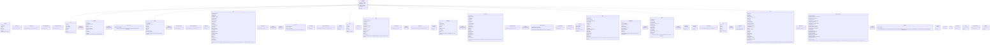

```mermaid
classDiagram
direction BT
class Address {
  + Address() 
  + Address(String, String, String) 
  - String state
  - String zipCode
  - String city
   String city
   String state
   String zipCode
}
class AuthRequest {
  + AuthRequest(String, String) 
}
class AuthResponse {
  + AuthResponse(String, String, String, String, Long) 
}
class BackendApplication {
  + BackendApplication() 
}
class BackendApplicationTests {
  + BackendApplicationTests() 
}
class BaseEntity {
  + BaseEntity() 
  - LocalDateTime updatedAt
  - LocalDateTime createdAt
  - boolean deleted
   LocalDateTime updatedAt
   LocalDateTime createdAt
   boolean deleted
}
class Benefit {
  + Benefit() 
  + Benefit(Long, String, String, Event) 
  - String title
  - Event event
  - Long benefitId
  - String description
   String description
   Long benefitId
   String title
   Event event
}
class BenefitRepository {
<<Interface>>

}
class Certificate {
  + Certificate() 
  + Certificate(Long, int, LocalDateTime, User, Event, Organization) 
  - User owner
  - Long certificateId
  - LocalDateTime dateCertified
  - Event event
  - int hours
  - Organization organization
   int hours
   Organization organization
   LocalDateTime dateCertified
   User owner
   Event event
   Long certificateId
}
class CertificateRepository {
<<Interface>>

}
class CertificateService {
  + CertificateService(CertificateRepository, UserService, EventService, OrganizationService, GeneralMapper) 
   List~Certificate~ allCertificates
}
class Comment {
  + Comment(Long, String, User, News, Comment, List~Comment~) 
  + Comment() 
  - List~Comment~ replies
  - Long commentId
  - Comment parentComment
  - String content
  - User user
  - News news
   Long commentId
   String content
   News news
   User user
   List~Comment~ replies
   Comment parentComment
}
class CommentRepository {
<<Interface>>

}
class CustomJwtConverter {
  + CustomJwtConverter() 
}
class CustomUserDetailsService {
  + CustomUserDetailsService(UserRepository) 
}
class DtoRequest {
  + DtoRequest() 
}
class Event {
  + Event(Long, String, String, LocalDateTime, LocalDateTime, String, Address, int, int, int, boolean, boolean, Organization, List~User~, List~News~, List~Tag~, List~Benefit~) 
  + Event() 
  - LocalDateTime endDate
  - String description
  - int volunteerSlots
  - int filledSlots
  - LocalDateTime startDate
  - Organization organization
  - List~User~ volunteers
  - Address address
  - List~News~ news
  - boolean completed
  - boolean active
  - int pointsReward
  - String title
  - List~Tag~ tags
  - List~Benefit~ benefits
  - String coverImageUrl
  - Long eventId
   String description
   List~Benefit~ benefits
   LocalDateTime endDate
   int volunteerSlots
   boolean active
   Organization organization
   List~News~ news
   LocalDateTime startDate
   Address address
   Long eventId
   List~Tag~ tags
   String title
   int filledSlots
   List~User~ volunteers
   int pointsReward
   boolean completed
   String coverImageUrl
}
class EventController {
  + EventController(EventService) 
}
class EventLikeRepository {
<<Interface>>

}
class EventRepository {
<<Interface>>

}
class EventService {
  + EventService(EventRepository, OrganizationService, GeneralMapper) 
   List~Event~ activeEvents
   List~Event~ allEvents
   List~Event~ upcomingEvents
}
class GeneralMapper {
  + GeneralMapper() 
}
class JwtAuthenticationFilter {
  + JwtAuthenticationFilter(JwtService, UserDetailsService) 
}
class JwtService {
  + JwtService() 
   SecretKey signInKey
}
class Like {
  + Like() 
  + Like(Long, User, Event) 
  - User user
  - Event event
  - Long likeId
   Long likeId
   User user
   Event event
}
class MailConfig {
  + MailConfig() 
}
class News {
  + News(Long, String, String, String, LocalDateTime, NewsType, List~Tag~, List~Comment~, Event) 
  + News() 
  - List~Tag~ eventTags
  - List~Comment~ comments
  - NewsType type
  - String body
  - Long newsId
  - String title
  - String imageUrl
  - LocalDateTime publishDate
  - Event event
   List~Comment~ comments
   Long newsId
   String title
   LocalDateTime publishDate
   List~Tag~ eventTags
   NewsType type
   Event event
   String body
   String imageUrl
}
class NewsController {
  + NewsController(NewsService) 
}
class NewsRepository {
<<Interface>>

}
class NewsService {
  + NewsService(NewsRepository, EventRepository, UserService) 
}
class NewsType {
<<enumeration>>
  - NewsType() 
}
class Notification {
  + Notification(Long, String, String, LocalDateTime, boolean, User) 
  + Notification() 
  - String type
  - Long notificationId
  - String message
  - LocalDateTime sentAt
  - boolean read
  - User user
   String type
   LocalDateTime sentAt
   boolean read
   String message
   Long notificationId
   User user
}
class NotificationRepository {
<<Interface>>

}
class Organization {
  + Organization(Long, String, String, String, String, String, String, String, String, Address, boolean, boolean, List~User~, List~Event~) 
  + Organization() 
  - String description
  - String passwordHash
  - String phone
  - Address address
  - String website
  - String CNPJ
  - String name
  - boolean verified
  - String email
  - List~User~ members
  - Long organizationId
  - List~Event~ events
  - boolean active
  - String logoImageUrl
   String description
   String CNPJ
   String phone
   boolean active
   String website
   List~User~ members
   Address address
   String logoImageUrl
   boolean verified
   String passwordHash
   String name
   String email
   Long organizationId
   List~Event~ events
}
class OrganizationController {
  + OrganizationController(OrganizationService) 
}
class OrganizationRepository {
<<Interface>>

}
class OrganizationService {
  + OrganizationService(OrganizationRepository, UserService, GeneralMapper) 
   List~Organization~ allOrganizations
   List~Organization~ activeOrganizations
}
class PasswordValidator {
  + PasswordValidator() 
}
class PhoneValidator {
  + PhoneValidator() 
}
class Profession {
  + Profession(String, String) 
  + Profession() 
  - String description
  - String profession
   String profession
   String description
}
class Profile {
  + Profile(Long, String, String, String, String, Profession, Address, ProfileMetadata, List~String~, List~String~, Set~Tag~, User) 
  + Profile() 
  - List~String~ skills
  - Set~Tag~ tags
  - Profession profession
  - String profileImageUrl
  - ProfileMetadata profileMetadata
  - String headline
  - List~String~ links
  - String profileUrl
  - User user
  - Long profileId
  - String bio
  - Address address
   String bio
   Long profileId
   ProfileMetadata profileMetadata
   String profileImageUrl
   Set~Tag~ tags
   String profileUrl
   Address address
   Profession profession
   List~String~ skills
   User user
   List~String~ links
   String headline
}
class ProfileMetadata {
  + ProfileMetadata(boolean, Integer, Integer, Integer, Integer, Integer) 
  + ProfileMetadata() 
  - Integer points
  - boolean publicProfile
  - Integer completedEvents
  - Integer totalVolunteerHours
  - Integer level
  - Integer streakDays
   Integer totalVolunteerHours
   Integer streakDays
   Integer completedEvents
   boolean publicProfile
   Integer level
   Integer points
}
class ProfileRepository {
<<Interface>>

}
class Report {
  + Report(Long, ReportType, String, ReportStatus, String, User, User, Event, Organization) 
  + Report() 
  - String adminNotes
  - Long reportId
  - User reportedBy
  - User reportedUser
  - ReportStatus status
  - Organization reportedOrganization
  - String description
  - Event reportedEvent
  - ReportType type
   User reportedUser
   String description
   ReportStatus status
   User reportedBy
   String adminNotes
   Organization reportedOrganization
   Event reportedEvent
   Long reportId
   ReportType type
}
class ReportRepository {
<<Interface>>

}
class ReportStatus {
<<enumeration>>
  - ReportStatus() 
}
class ReportType {
<<enumeration>>
  - ReportType() 
}
class SecurityConfig {
  + SecurityConfig(JwtAuthenticationFilter, UserDetailsService) 
}
class Tag {
  + Tag(Long, String, String) 
  + Tag() 
  - String code
  - Long id
  - String label
   Long id
   String code
   String label
}
class TagRepository {
<<Interface>>

}
class TagService {
  + TagService(TagRepository) 
   List~Tag~ allTags
}
class User {
  + User(Long, String, String, String, String, String, String, UserType, LocalDate, boolean, boolean, Profile, List~Organization~, List~Event~, List~Report~, List~Report~, List~Notification~) 
  + User() 
  - String email
  - boolean active
  - String CPF
  - String firstname
  - UserType userType
  - List~Organization~ organizations
  - String phone
  - Profile profile
  - Long userId
  - String lastname
  - boolean emailVerified
  - String passwordHash
  - List~Report~ reportsMade
  - List~Event~ events
  - List~Report~ reportsReceived
  - List~Notification~ notifications
  - LocalDate birthDate
   List~Report~ reportsReceived
   String CPF
   List~Report~ reportsMade
   String phone
   boolean active
   Long userId
   Profile profile
   LocalDate birthDate
   String passwordHash
   String email
   String lastname
   boolean emailVerified
   List~Notification~ notifications
   String firstname
   List~Organization~ organizations
   UserType userType
   List~Event~ events
}
class UserController {
  + UserController(UserService) 
}
class UserDashboardDTO {
  + UserDashboardDTO() 
  + UserDashboardDTO(List~EventResume~, List~EventResume~, float, EventDetail, int, int, int, Map~String, MonthlyActivity~, int, int, List~CertificateResume~, List~CategoryStats~, List~Achievement~, List~NotificationResume~) 
  - int totalHorasCertificadas
  - Map~String, MonthlyActivity~ atividadesMensais
  - int totalEventosParticipados
  - List~Achievement~ achievements
  - int pontosAcumulados
  - int totalHorasVoluntariadas
  - List~EventResume~ eventosPassados
  - float avaliacaoMediaUsuario
  - List~NotificationResume~ notifications
  - List~EventResume~ eventosCompletados
  - EventDetail eventoDetalhes
  - int totalCertificados
  - List~CategoryStats~ categoryStats
  - List~CertificateResume~ certificados
   List~EventResume~ eventosCompletados
   List~EventResume~ eventosPassados
   int pontosAcumulados
   int totalCertificados
   float avaliacaoMediaUsuario
   List~CertificateResume~ certificados
   int totalEventosParticipados
   EventDetail eventoDetalhes
   List~CategoryStats~ categoryStats
   List~NotificationResume~ notifications
   int totalHorasVoluntariadas
   Map~String, MonthlyActivity~ atividadesMensais
   List~Achievement~ achievements
   int totalHorasCertificadas
}
class UserRepository {
<<Interface>>

}
class UserService {
  + UserService(UserRepository, CertificateRepository, ProfileRepository, TagRepository, GeneralMapper, PasswordEncoder, JwtService, AuthenticationManager, CustomUserDetailsService, NotificationRepository, NewsRepository) 
   List~User~ allUsers
   List~User~ activeUsers
}
class UserType {
<<enumeration>>
  - UserType() 
}
class ValidPassword
class ValidPhone
class WebConfig {
  + WebConfig() 
}
class build {
  + build() 
   MetaClass metaClass
}
class passwordGenerator {
  + passwordGenerator() 
}
class settings {
  + settings() 
   MetaClass metaClass
}

Benefit  -->  BaseEntity 
Certificate  -->  BaseEntity 
Comment  -->  BaseEntity 
Event  -->  BaseEntity 
Like  -->  BaseEntity 
News  -->  BaseEntity 
Organization  -->  BaseEntity 
Profile  -->  BaseEntity 
Report  -->  BaseEntity 
User  -->  BaseEntity 
```
